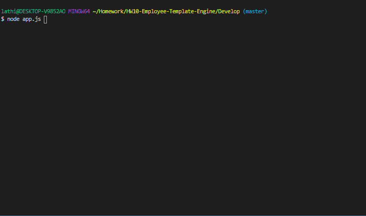
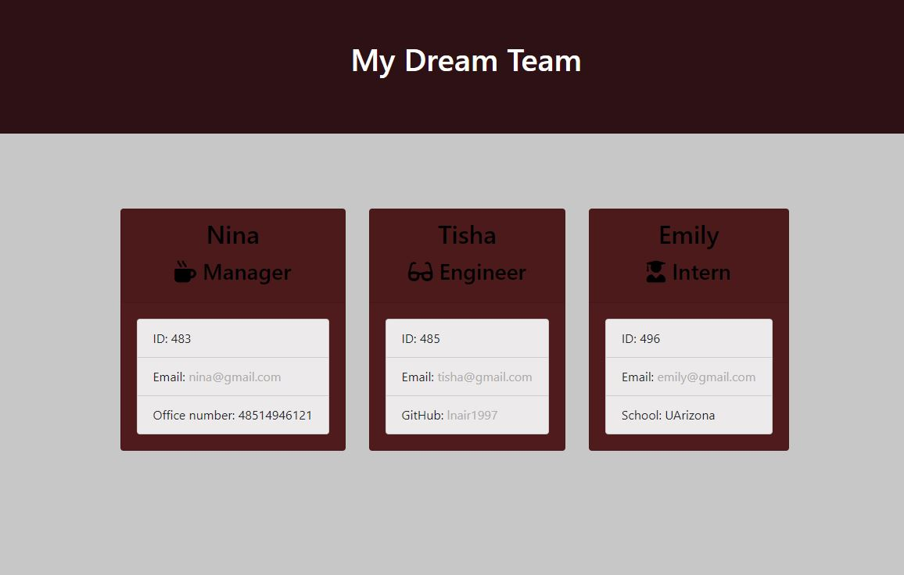

# HW10-Employee-Template-Engine
  
## Description-

- Building a software engineering team generator command line application that will prompt the user for information about the team. It will pass through all unit tests and when user completes building the team, a HTML file is created.

## Table of Contents
  1. [Technologies Used](#technologiesused)
  2. [Installation](#installation)
  3. [Tests](#tests)
  4. [Gif Walkthrough](#gifwalkthrough)
  5. [Team HTML](#teamhtml)

## Technologies Used:

1. HTML
2. CSS
3. Javascript
4. Node
5. ScreenToGif

## Installation:
```
npm inquirer
npm path
```
## Tests:

- To run the tests use "npm run test" in the terminal.

## Gif Walkthrough:



## Team HTML:
> 